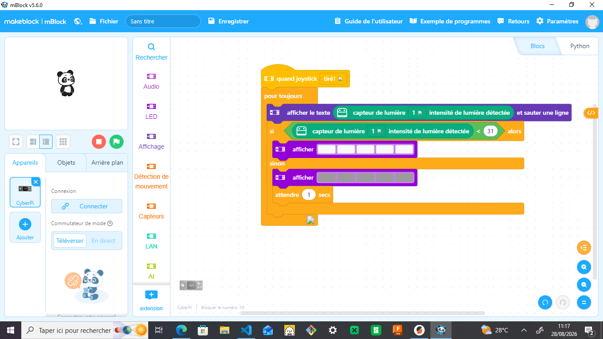
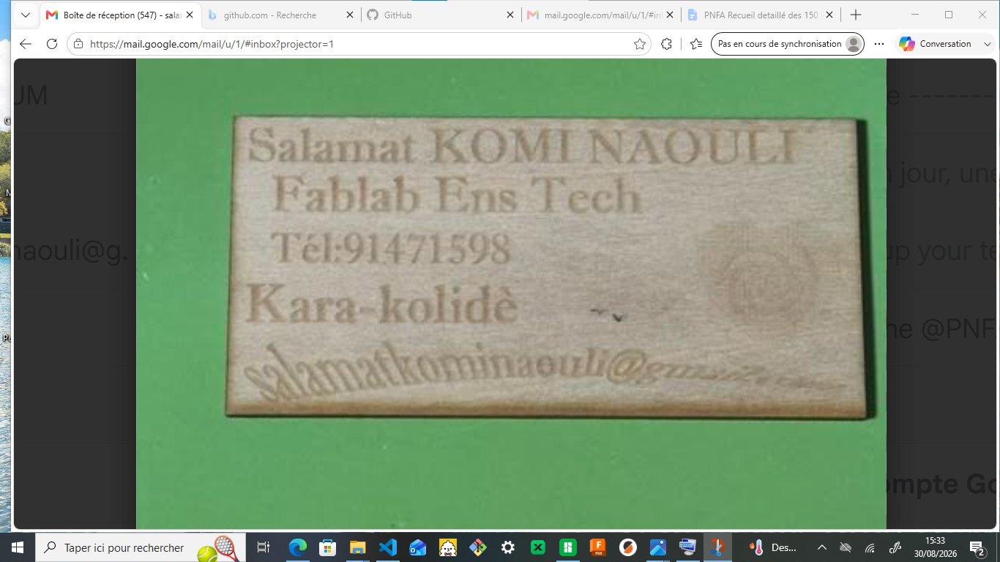

# JOURNAL DU 28 AOÛT 2026 de Salamat KOMI NAOULI

## Fait aujourd'hui

- éléctronique:projet pratique 2 
- découpe laser ded carte de visite
- impression 3D
- fusion:projet

## Appris

- réalisation du projet 2
> comment programmer dans mBlock pour exécuter et permettre au cyberPI d'allumer la lumière lorsque la nature devient sombre et pas de lumière lorsque la nature est claire

- imprimer et découper ma carte de visite

- imprimente 3D

- projet
> Pour la réalisation de nos projets, on procède par le Disign thinking ou par la méthode spirale (ces deux méthodes se complète en fait).Le disign thinking qui est centré sur l'utilisateur,déroule les 5 étapes sur un cas réel de notre discipline;représente l'idée retenue par un croquis côté et un scénario d'usage.
> Le disign thinking est une méthode de conception centrée sur l'usager qui sert à ouvrir puit trancher une origine documentée
> N'étant pas un processus linéaire mais ittératif, il a 5 étapes à savoir: empathie;définir;idéer;prototyper;tester.
> l' empathie ne consiste pas à imaginer mais à recueillir.
> définir consiste à énoncer en une et une seule phrase.
> idéer consiste à ouvrir largement,reformer explicitement.
> les contraintes ne bloquent pas la créativité mais elles la cadre.
> il existe 4 grands étapes de la méthode spirale.
> il faudrait caler les boucles du projet  du programme sur les jalon du programme
> un jalon n'est pas une date de rendu mais la fin de la boucle.

## Ratté puis corrigé

- pas pu imprimer mon projet 3D par manque de temps ainsi j'ai copié sur une clé 

## A faire demain

- petite présentation des projets
