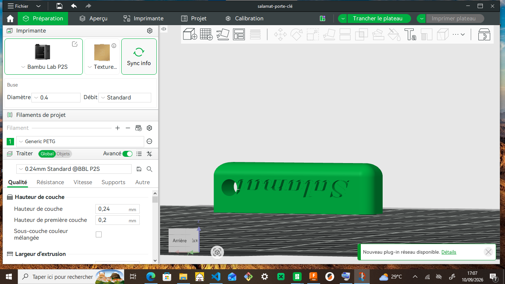

# JOURNAL DU 1er SEPTEMBRE 2026 DE Salamat KOMI NAOULI

## Fait aujourd'hui

- conception d'un cube dans Fusion 360
- cablage élèctronique : maîtriser la Breadboard
- impression DTF avec XTool

## appris

- il existe trois manières de procéder pour obtenir une fabrication : créer ..., outil de révolution, outil excurtion
- conception d'un porte clé et importation 

- Maîtriser la Breadboard
- comment réaliser un schéma sur la Breadboard
- la Breadboard est subdivisée en trois parties : 
   - le haut
   - le milieu
   - le bas
- les liaisons de continuités
   - la continuité est par ligne sur le haut et le bas
   - la continuité est par colonne au milieu
- il est interdit de placer les deux connections d'un même composant sur une ligne( haut et bas) ou sur une colonne (pour le milieu)
- exercice
- impression DTF avec xTool
- les étapes du DTF 
   - concevoir
   - imprimer
   - poudrer
   - cuire
   - presser
   - retirer

## Ratée et corrigée

## A faire demain

- mBuilt 2
- fondementaux pour future Fabmanagers
