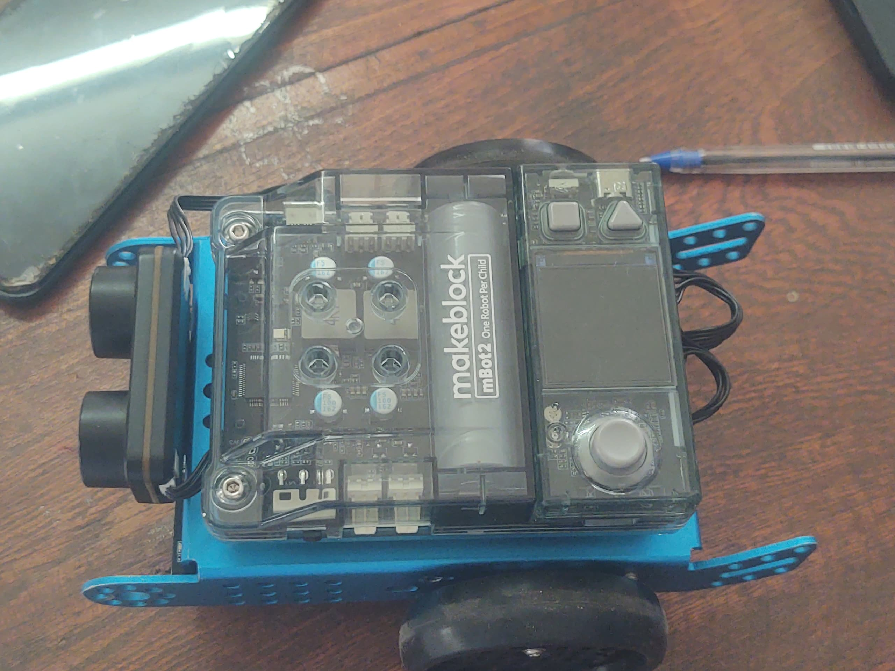

# Journal du 02 septembre de Salamat KOMI NAOULI

## Fait aujourd'hui

- programmation en électronique : le mBuilt 2

- Les bases de l'algorithmique débranché : Fondementaux pour future fabmanegers

## Appris

- programmtion en électronique

- Fondementaux pour future fabmanagers : 
    - notion d'algorithme qui est une suite d'instructions ordonnées,logique qui permet de résoudre un problème donné
    - les critères qui définissent un algorithme:
       - une suite ordonnée d'instructions
       - un nombre fini d'instructions
       - des instructions précises,qui résolvent un problème donné
    - les algorithmes ont toujours été très utiles

## ratté et corrigé

## A faire demain

- initiation à la programmation: Python
