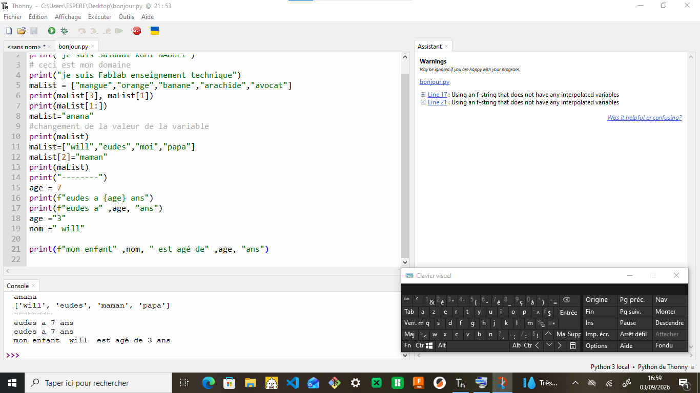

# JOURNAL DU 4 SEPTEMBRE 2026 DE Salamat KOMI NAOULI

## Fait aujourd'hui

- Programmation
   - Les structures de contrôle
   - les conditions
   - les boucles
   - exercices
   - tuples et dictionnaires
- Fabrication des PCB

## Appris

- Programmation
   - Les structures de contrôle : les opérateurs indispensables
       - arithmétique: comparaison (==),puissance (**),division entière (//),division réelle (/),modulo (%)
       - logique : and, or, not
       - comparaison : ==, !=, <>, <=, =>
       - affectation : =; +=; -=; *=; /=
   - les conditions : if; elif; else
   - les boucles : for; while
   - exercices
   
   - tuples et dictionnaires
- Fabrication des PCB: des méthodes traditionnelles à la fabrication numérique avec xTool F2 Ultra
   - les principales méthodes de fabrication:
     - perchlorure de fer
     - papier glacé plus fer à repasser
     - fabrication numérique
   - du schéma électronique au PCB
   - pourquoi utiliser la xTool F2 Ultra ?
      > facilite la fabrication numérique du PCB notamment :
      - gravure et traitement précis du matériau
      - traitement automatisé sans intervention nouvelle continue
      - repétabilité : chaque plaque est identique
      - rapidité d'exécution
      - réduction des maniûlations nouvelles
      - bien adapté au prototype rapide