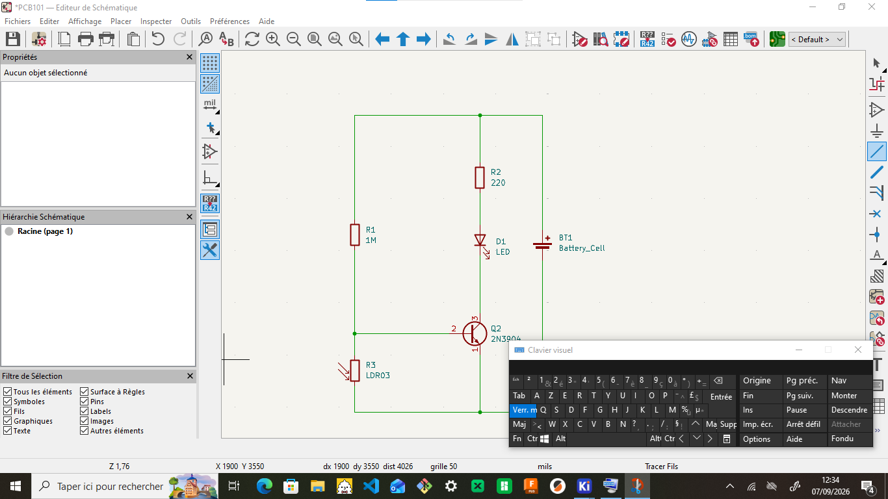

# JOURNAL DU 7 SEPTEMBRE 2026 DE Salamat KOMI NAOULI

## Fait aujourd'hui

- accentuation sur l' importance du PCB et programmation électronique

## Appris

- circuit imprimé : PCB
- pourquoi passer du prototypage au PCB
- comparaison entre expérimentation et solution finale
- anatomie d'un PCB : éléments essentiels
- de l'idée au schéma : connaitre les composants et leur rôle
- KiCad 

## ratté et corrigé

- Réalisation du circuit avec beaucoup d'erreur
- pour la correction , j'ai fait appel aux formateur puis les collègues

## A faire demain

- projet puis CNC
