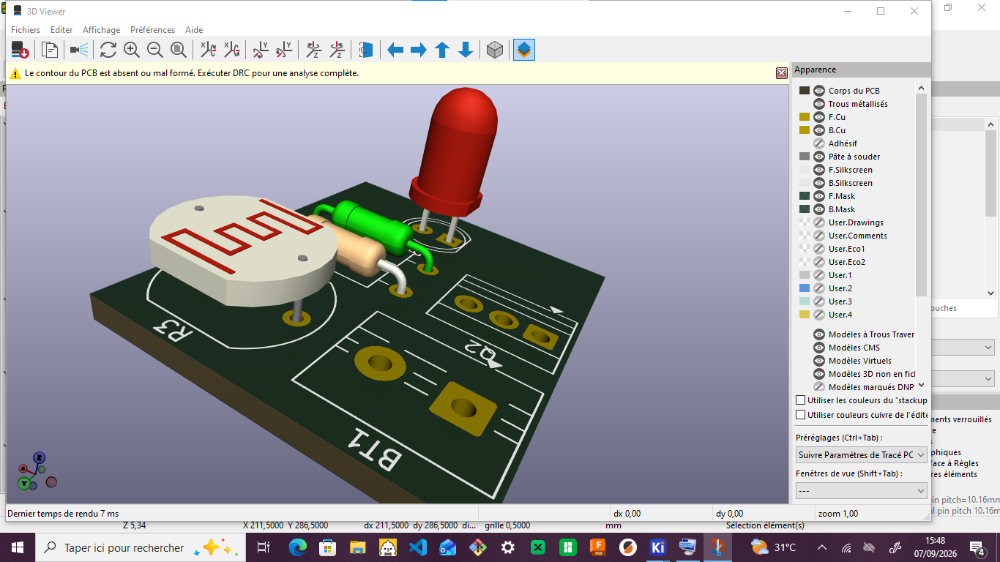

# JOURNAL DU 09 SEPTEMBRE 2026 de Salamat KOMI NAOULI

## Fait aujourd'hui et appris

- Recherches sur le cicuit de la commande du minuteur  
- Conception shéatique avec KiCad
- Installation de la librairie du XIAO ESP32 S3 pour KiCad 
- Exemple de circuit sur Kicad 
- Création de la librairie pour l'ecran OLED 128x64
- Créeation de nouveau symbole
- Création d'une nouvelle empreinte
- Assignation d'empreint
- Edition de PCB

-  RAPPELS 
   - Les variables
   - Structures Conditionnelles 
   - Les boucles
   - Les commentaires
   - Les fonctions
   - Les opérateurs: 
      - Arithmétiques
      - Logiques
      - Comparaisons
      - Affectations ...
- Informatique: Science de traitement automatique de l'information par les ordinateurs
    - Ordinateur: (Parle le langage machine) Composé de HARDWARE (Péripherique d'entrée + Périphérique de sortie) + SOFTWARE
    - Logiciel  Ensemble d'Applications
    - Application: Ensemble de programmes
    - Programme: Ensemble d'instructuions
 - CONVENTIONS
    - La distance de séparation entre les broches des circuits intégrés est de 2,5 mm.
    - Pour perforer un circuit imprimé, le prémier trou est un carré et le reste des trous sont des cercles (de gauche à droite).

    ## ratté et corrigé
    - PCB avec erreur et avertissement